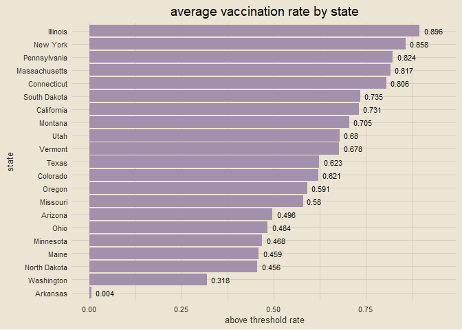
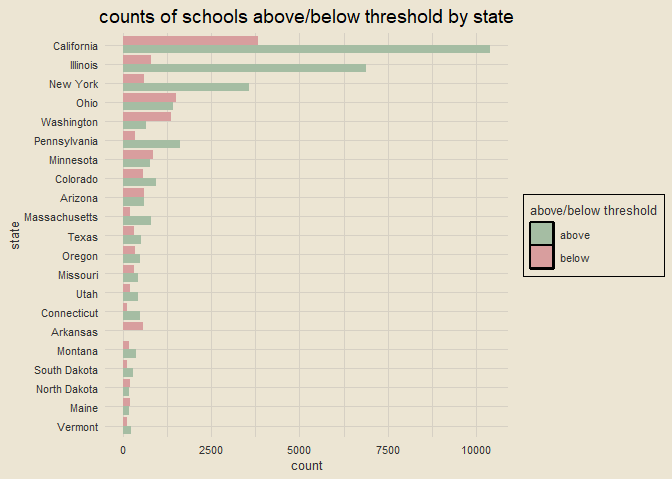
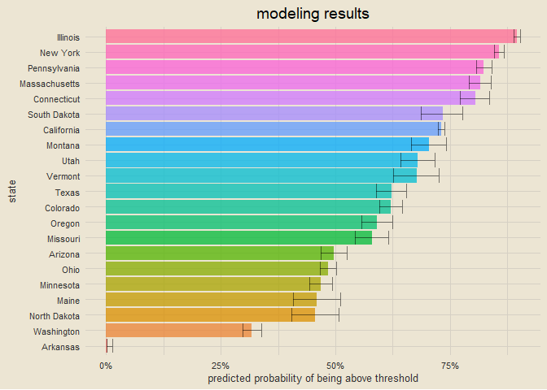
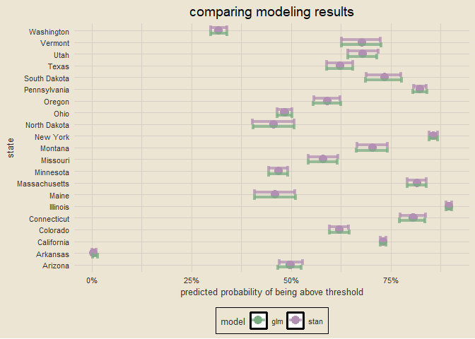

using tidymodels to model vaccination rate data
================

### setup

``` r
tictoc::tic()
library(tidyverse)
library(tidymodels)
library(rstanarm)

theme_custom = tvthemes::theme_avatar() +
  theme(plot.title = element_text(hjust = 0.5),
        panel.grid.major = element_line(linewidth = 0.5, colour = "#D6D0C4"),
        panel.grid.minor = element_line(linewidth = 0.5, colour = "#D6D0C4"))

theme_set(theme_custom)
```

------------------------------------------------------------------------

### data import

``` r
link = "https://raw.githubusercontent.com/rfordatascience/tidytuesday/master/data/2020/2020-02-25/measles.csv"
measles = read_csv(link, col_types = cols())
glimpse(measles)
```

    ## Rows: 66,113
    ## Columns: 16
    ## $ index    <dbl> 1, 2, 3, 4, 5, 6, 7, 8, 9, 10, 10, 11, 12, 13, 14, 15, 15, 16~
    ## $ state    <chr> "Arizona", "Arizona", "Arizona", "Arizona", "Arizona", "Arizo~
    ## $ year     <chr> "2018-19", "2018-19", "2018-19", "2018-19", "2018-19", "2018-~
    ## $ name     <chr> "A J Mitchell Elementary", "Academy Del Sol", "Academy Del So~
    ## $ type     <chr> "Public", "Charter", "Charter", "Charter", "Charter", "Public~
    ## $ city     <chr> "Nogales", "Tucson", "Tucson", "Phoenix", "Phoenix", "Phoenix~
    ## $ county   <chr> "Santa Cruz", "Pima", "Pima", "Maricopa", "Maricopa", "Marico~
    ## $ district <lgl> NA, NA, NA, NA, NA, NA, NA, NA, NA, NA, NA, NA, NA, NA, NA, N~
    ## $ enroll   <dbl> 51, 22, 85, 60, 43, 36, 24, 22, 26, 78, 78, 35, 54, 54, 34, 5~
    ## $ mmr      <dbl> 100, 100, 100, 100, 100, 100, 100, 100, 100, 100, 100, 100, 1~
    ## $ overall  <dbl> -1, -1, -1, -1, -1, -1, -1, -1, -1, -1, -1, -1, -1, -1, -1, -~
    ## $ xrel     <lgl> NA, NA, NA, NA, NA, NA, NA, NA, NA, NA, NA, NA, NA, NA, NA, N~
    ## $ xmed     <dbl> NA, NA, NA, NA, 2.33, NA, NA, NA, NA, NA, NA, 2.86, NA, 7.41,~
    ## $ xper     <dbl> NA, NA, NA, NA, 2.33, NA, 4.17, NA, NA, NA, NA, NA, NA, NA, N~
    ## $ lat      <dbl> 31.34782, 32.22192, 32.13049, 33.48545, 33.49562, 33.43532, 3~
    ## $ lng      <dbl> -110.9380, -110.8961, -111.1170, -112.1306, -112.2247, -112.1~

------------------------------------------------------------------------

### creating data frame tracking if schools are above or below threshold

``` r
measles_df = measles |>
  filter(mmr > 0) |>
  transmute(state,
            mmr_threshold = case_when(mmr > 95 ~ "above",
                                      T ~ "below")) |>
  mutate_if(is.character, factor)

sample_n(measles_df, 10)
```

    ## # A tibble: 10 x 2
    ##    state        mmr_threshold
    ##    <fct>        <fct>        
    ##  1 Pennsylvania above        
    ##  2 California   below        
    ##  3 New York     above        
    ##  4 Illinois     below        
    ##  5 Illinois     above        
    ##  6 Montana      above        
    ##  7 Illinois     above        
    ##  8 California   above        
    ##  9 New York     above        
    ## 10 New York     above

------------------------------------------------------------------------

### average rate of vaccination by state

``` r
measles_df |>
  group_by(state) |>
  summarise(mmr = round(mean(mmr_threshold == "above"), 3)) |>
  arrange(desc(mmr)) |>
  ggplot(aes(reorder(state, mmr), mmr)) +
  geom_col(fill = "#A390AD", position = "dodge") +
  geom_text(aes(label = mmr), hjust = -0.25, size = 3) +
  coord_flip(ylim = c(0, 0.95)) +
  labs(x = "state", y = "above threshold rate",
       title = "average vaccination rate by state")
```

<!-- -->

------------------------------------------------------------------------

### above/below threshold counts by state

``` r
measles_df |>
  count(state, mmr_threshold) |>
  ggplot(aes(reorder(state, n), n)) +
  geom_col(aes(fill = mmr_threshold), position = "dodge") +
  coord_flip() +
  scale_fill_manual(values = c("#A5BDA3", "#D89E9E")) +
  labs(x = "state", y = "count", fill = "above/below threshold",
       title = "counts of schools above/below threshold by state") +
  theme(legend.position = "right")
```

<!-- -->

------------------------------------------------------------------------

### fitting a basic logistic regression model

``` r
glm_fit = logistic_reg() |>
  set_engine("glm") |>
  fit(mmr_threshold ~ state, data = measles_df)

glm_fit
```

    ## parsnip model object
    ## 
    ## Fit time:  771ms 
    ## 
    ## Call:  stats::glm(formula = mmr_threshold ~ state, family = stats::binomial, 
    ##     data = data)
    ## 
    ## Coefficients:
    ##        (Intercept)       stateArkansas     stateCalifornia       stateColorado  
    ##            0.01537             5.62828            -1.01490            -0.50960  
    ##   stateConnecticut       stateIllinois          stateMaine  stateMassachusetts  
    ##           -1.44249            -2.17220             0.14745            -1.50860  
    ##     stateMinnesota       stateMissouri        stateMontana       stateNew York  
    ##            0.11412            -0.33815            -0.88650            -1.81135  
    ##  stateNorth Dakota           stateOhio         stateOregon   statePennsylvania  
    ##            0.16288             0.04974            -0.38170            -1.56000  
    ##  stateSouth Dakota          stateTexas           stateUtah        stateVermont  
    ##           -1.03338            -0.51635            -0.76884            -0.75775  
    ##    stateWashington  
    ##            0.74762  
    ## 
    ## Degrees of Freedom: 44156 Total (i.e. Null);  44136 Residual
    ## Null Deviance:       53780 
    ## Residual Deviance: 47100     AIC: 47150

------------------------------------------------------------------------

### getting predictions and confident intervals

``` r
new_schools = tibble(state = unique(measles_df$state))
mean_pred = predict(glm_fit, new_data = new_schools, type = "prob")
conf_int = predict(glm_fit, new_data = new_schools, type = "conf_int")

schools_res = new_schools |>
  bind_cols(mean_pred) |>
  bind_cols(conf_int)

glimpse(schools_res)
```

    ## Rows: 21
    ## Columns: 7
    ## $ state             <fct> Arizona, Arkansas, California, Colorado, Connecticut~
    ## $ .pred_above       <dbl> 0.496157131, 0.003527432, 0.730966608, 0.621101526, ~
    ## $ .pred_below       <dbl> 0.5038429, 0.9964726, 0.2690334, 0.3788985, 0.193548~
    ## $ .pred_lower_above <dbl> 0.4675632434, 0.0008868457, 0.7236169219, 0.59631829~
    ## $ .pred_upper_above <dbl> 0.52477618, 0.01392083, 0.73819156, 0.64526835, 0.83~
    ## $ .pred_lower_below <dbl> 0.4752238, 0.9860792, 0.2618084, 0.3547317, 0.163620~
    ## $ .pred_upper_below <dbl> 0.5324368, 0.9991132, 0.2763831, 0.4036817, 0.227461~

------------------------------------------------------------------------

### viewing modeling results

``` r
schools_res |>
  mutate(state = fct_reorder(state, .pred_above)) |>
  ggplot(aes(state, .pred_above)) +
  geom_col(aes(fill = state), show.legend = F, alpha = 0.75) +
  geom_errorbar(aes(ymin = .pred_lower_above, ymax = .pred_upper_above), alpha = 0.5) +
  scale_y_continuous(labels = scales::percent_format()) +
  coord_flip() +
  labs(y = "predicted probability of being above threshold",
       title = "modeling results")
```

<!-- -->

------------------------------------------------------------------------

### fitting a Bayesian model

``` r
options(mc.cores = parallel::detectCores())
prior_dist = student_t(df = 2)

# this takes a while to finish up
stan_fit = logistic_reg() |>
  set_engine("stan",
             prior = prior_dist,
             prior_intercept = prior_dist) |>
  fit(mmr_threshold ~ state, data = measles_df)

stan_fit
```

    ## parsnip model object
    ## 
    ## Fit time:  2m 6.4s 
    ## stan_glm
    ##  family:       binomial [logit]
    ##  formula:      mmr_threshold ~ state
    ##  observations: 44157
    ##  predictors:   21
    ## ------
    ##                    Median MAD_SD
    ## (Intercept)         0.0    0.1  
    ## stateArkansas       5.6    0.7  
    ## stateCalifornia    -1.0    0.1  
    ## stateColorado      -0.5    0.1  
    ## stateConnecticut   -1.4    0.1  
    ## stateIllinois      -2.2    0.1  
    ## stateMaine          0.2    0.1  
    ## stateMassachusetts -1.5    0.1  
    ## stateMinnesota      0.1    0.1  
    ## stateMissouri      -0.3    0.1  
    ## stateMontana       -0.9    0.1  
    ## stateNew York      -1.8    0.1  
    ## stateNorth Dakota   0.2    0.1  
    ## stateOhio           0.1    0.1  
    ## stateOregon        -0.4    0.1  
    ## statePennsylvania  -1.6    0.1  
    ## stateSouth Dakota  -1.0    0.1  
    ## stateTexas         -0.5    0.1  
    ## stateUtah          -0.8    0.1  
    ## stateVermont       -0.7    0.1  
    ## stateWashington     0.8    0.1  
    ## 
    ## ------
    ## * For help interpreting the printed output see ?print.stanreg
    ## * For info on the priors used see ?prior_summary.stanreg

------------------------------------------------------------------------

### getting modeling results in a data frame

``` r
bayes_pred = predict(stan_fit,
                     new_data = new_schools,
                     type = "prob")

bayes_int = predict(stan_fit,
                    new_data = new_schools,
                    type = "conf_int")

bayes_res = new_schools |>
  bind_cols(bayes_pred) |>
  bind_cols(bayes_int)

glimpse(bayes_res)
```

    ## Rows: 21
    ## Columns: 7
    ## $ state             <fct> Arizona, Arkansas, California, Colorado, Connecticut~
    ## $ .pred_above       <dbl> 0.498588633, 0.003413361, 0.731003699, 0.620886838, ~
    ## $ .pred_below       <dbl> 0.5014114, 0.9965866, 0.2689963, 0.3791132, 0.193261~
    ## $ .pred_lower_above <dbl> 0.4695627788, 0.0007152152, 0.7236317784, 0.59631988~
    ## $ .pred_upper_above <dbl> 0.5285012, 0.0107657, 0.7379296, 0.6443436, 0.837954~
    ## $ .pred_lower_below <dbl> 0.4714988, 0.9892343, 0.2620704, 0.3556564, 0.162045~
    ## $ .pred_upper_below <dbl> 0.5304372, 0.9992848, 0.2763682, 0.4036801, 0.226402~

------------------------------------------------------------------------

### comparing basic logistic regression and Bayesian modeling results

``` r
schools_res |>
  mutate(model = "glm") |>
  bind_rows(bayes_res |>
              mutate(model = "stan")) |>
  mutate(stat = fct_reorder(state, .pred_above)) |>
  ggplot(aes(state, .pred_above)) +
  geom_point(aes(col = model), size = 4) +
  geom_errorbar(aes(ymin = .pred_lower_above, ymax = .pred_upper_above, col = model),
                linewidth = 1.5, alpha = 0.75, position = "dodge") +
  scale_y_continuous(labels = scales::percent_format()) +
  scale_color_manual(values = c("#7AAC82", "#B38FB3")) +
  coord_flip() +
  labs(y = "predicted probability of being above threshold",
       title = "comparing modeling results")
```

<!-- -->

------------------------------------------------------------------------

### script runtime

``` r
tictoc::toc()
```

    ## 134.89 sec elapsed
